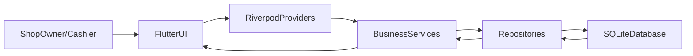

## Overview

We will design a Flutter 3.x application (Android + Windows) with a clean, modular architecture, Gujarati-first UI, and an offline SQLite database. The app will support Billing/POS, Inventory & Stock, Customer Khata, Reports, User Management, and Settings/Backup in v1.0.

## High-Level Architecture

- **App layers**:
  - **Presentation layer (UI)**: Flutter screens, widgets, and Riverpod providers.
  - **Application layer (services/use-cases)**: Classes that implement business logic (e.g., `CreateBillService`, `RecordPaymentService`).
  - **Data layer**: Repositories (`ItemRepository`, `BillRepository`, etc.) and SQLite DAOs using `sqflite`.
- **State management**: Riverpod for global state and screen-specific providers.
- **Navigation**:
  - Android: bottom navigation for main modules + full-screen flows for tasks.
  - Windows: persistent side navigation (Rail/Drawer) for main modules + main content area.
- **Localization**:
  - All UI strings in Gujarati using a central `AppStrings` or `intl`-based localization.
  - English only where required for admin/dev (e.g., debug logs, internal names).
- **Styling**:
  - Global theme with `Noto Sans Gujarati` via Google Fonts.
  - Large buttons (≥48dp), numpad components for numeric entry, color-coded statuses.

## Data Model & SQLite Schema (v1)

We’ll create a small, normalized schema with clear relations, designed so a future cloud sync layer can be added without breaking changes.

- **Core tables** (with example columns):
  - `**items`** (inventory)
    - `id` (PK, integer autoincrement)
    - `name_gu` (TEXT)
    - `category_id` (FK -> `categories.id`)
    - `barcode` (TEXT, nullable)
    - `unit` (TEXT, e.g., પીસ, કિલો)
    - `sale_price` (REAL)
    - `purchase_price` (REAL)
    - `current_stock` (REAL)
    - `low_stock_threshold` (REAL)
    - `is_active` (INTEGER bool)
  - `**categories`**
    - `id`, `name_gu`, `color_code` (for UI)
  - `**bills`** (sales bills)
    - `id` (PK)
    - `bill_number` (TEXT or INTEGER, shop-sequential)
    - `date_time` (INTEGER epoch)
    - `customer_id` (FK -> `customers.id`, nullable for walk-in)
    - `subtotal` (REAL)
    - `discount_amount` (REAL)
    - `tax_amount` (REAL, optional for GST later)
    - `total_amount` (REAL)
    - `paid_amount` (REAL)
    - `payment_mode` (TEXT: cash, UPI, etc.)
    - `created_by_user_id` (FK -> `users.id`)
  - `**bill_items`** (line items per bill)
    - `id` (PK)
    - `bill_id` (FK -> `bills.id`)
    - `item_id` (FK -> `items.id`)
    - `quantity` (REAL)
    - `unit_price` (REAL)
    - `line_total` (REAL)
  - `**customers`**
    - `id` (PK)
    - `name` (TEXT)
    - `phone` (TEXT)
    - `address` (TEXT)
    - `note` (TEXT)
  - `**khata_entries`** (customer udhar ledger)
    - `id` (PK)
    - `customer_id` (FK -> `customers.id`)
    - `related_bill_id` (FK -> `bills.id`, nullable for manual entry)
    - `date_time` (INTEGER epoch)
    - `type` (TEXT: `debit` for udhar, `credit` for payment)
    - `amount` (REAL)
    - `note` (TEXT)
    - `balance_after` (REAL, cached running balance for fast UI)
  - `**purchases`** (stock purchase entries, optional v1 detail level)
    - `id`, `date_time`, `supplier_name`, `total_amount`, etc.
  - `**purchase_items`**
    - `id`, `purchase_id`, `item_id`, `quantity`, `unit_cost`, `line_total`.
  - `**users`**
    - `id` (PK)
    - `name` (TEXT)
    - `pin` (TEXT hashed or stored simply for local-only)
    - `role` (TEXT: `owner`, `staff`)
    - `is_active` (INTEGER bool)
  - `**settings**` (key-value table)
    - `key` (TEXT PK)
    - `value` (TEXT JSON/string)
- **Migrations**:
  - `schema_version = 1` with `onCreate` creating all tables.
  - `onUpgrade` will handle version bumps later (e.g., tax columns, sync ids).
- **Transactions**:
  - Use `transaction` blocks for operations that touch multiple tables, such as billing + stock deduction + khata entry.

## Main Feature Modules & Screens

### 1. Billing / POS

- **Goals**: Fast billing in ≤3 taps for common actions, numeric-only input, thermal printing with Gujarati text rendered as image.
- **Core screens**:
  - `**BillingHomeScreen`**:
    - Item search (by name/barcode) with large tappable list.
    - Cart list showing selected items, quantities, and line totals.
    - Numpad for quantity and amount edits.
    - Discount input (₹ or %) via numpad.
    - Summary card with subtotal, discount, total (₹ with Indian formatting).
    - `બચાવો અને બીલ પ્રિન્ટ કરો` (Save & Print) button.
  - `**CustomerSelectBottomSheet`** (optional modal for linking customer/khata).
  - `**PaymentDialog`**:
    - Amount due, amount received (numpad), change, payment mode buttons.
- **Flows**:
  - Add item → adjust quantity via numpad → apply discount → choose customer (optional) → select payment → confirm → single transaction writes `bills`, `bill_items`, stock changes in `items`, and optional `khata_entries` if partial/zero payment.
- **Thermal printing**:
  - Use Flutter canvas to render full bill in Gujarati as an image and send to thermal printer plugin.

### 2. Inventory & Stock

- **Goals**: Simple management of items/categories, quick low-stock visibility, one-purpose screens.
- **Core screens**:
  - `**ItemListScreen`**:
    - Search bar, filter by category, low-stock filter.
    - Row per item: name, current stock, price, color-coded low-stock.
  - `**ItemDetailScreen` / `ItemEditScreen`**:
    - Single-purpose: add/edit item (name, price, unit, category, low-stock threshold).
    - Numeric fields via numpad.
  - `**CategoryListScreen`** & simple add/edit category sheet.
  - `**StockAdjustmentScreen`** (optional v1): for manual stock corrections.
- **Logic**:
  - Repositories handle CRUD; Riverpod providers expose item lists, filtered by name/category/low-stock.

### 3. Customer Khata / Udhar

- **Goals**: Easy per-customer balance view and quick record of udhar/payment.
- **Core screens**:
  - `**CustomerListScreen`**:
    - List of customers with current balance (from last `khata_entries.balance_after`).
    - Color-coded: green for zero/positive (customer paid), red for high udhar.
  - `**CustomerKhataDetailScreen`**:
    - Timeline of entries: date, type (udhar/payment), amount, running balance.
    - Quick actions: `ઉધાર ઉમેરો` (Add Udhar), `ચુકવણી નોંધાવો` (Record Payment).
  - `**CustomerEditScreen`**: add/edit customer.
- **Logic**:
  - Creating udhar from a bill: auto-create `khata_entries` with link to bill.
  - Manual entries: form with type, amount, note; update running balance inside a transaction.

### 4. Reports

- **Goals**: Simple owner-friendly views with clear Gujarati labels and Indian currency.
- **Core screens**:
  - `**ReportsHomeScreen`**:
    - Cards: Today’s sales, This week, This month.
    - Entry points to detailed reports.
  - `**SalesReportScreen`**:
    - Date range picker.
    - Totals: number of bills, total sales, cash vs UPI, average bill value.
  - `**TopItemsReportScreen`** (optional v1): top-selling items by quantity/amount.
  - `**KhataReportScreen`** (optional v1): list of customers with outstanding balance.
- **Implementation**:
  - SQL aggregate queries (SUM, COUNT, GROUP BY) mapped to report models.

### 5. User Management

- **Goals**: Simple local-only security: owner vs staff, optional PIN lock.
- **Core screens**:
  - `**LoginPinScreen`** (optional on startup): numeric PIN pad.
  - `**UserListScreen`** (owner-only): list users, add staff, reset PIN.
  - `**UserEditScreen`**: define role and PIN.
- **Permissions**:
  - Owner can access all settings, backups, and user management.
  - Staff restricted from sensitive areas (e.g., editing old bills, deleting records, backups).

### 6. Settings, Backup & Shop Profile

- **Goals**: Central place for shop info, app preferences, and manual backup.
- **Core screens**:
  - `**SettingsScreen`**:
    - Shop profile: name (Gujarati), address, phone, GSTIN (optional), bill footer text.
    - Appearance: large text toggle, color theme.
    - Billing options: default tax, default payment mode, bill number start.
    - Backup & restore.
  - `**BackupScreen`**:
    - Button: `ડેટા એક્સપોર્ટ કરો` (Export Data) → JSON file to device storage.
    - Button: `ડેટા ઇમ્પોર્ટ કરો` (Import Data) with clear warning dialog.
- **Backup implementation**:
  - Create JSON with tables and rows.
  - Write to device storage (proper permissions on Android, file picker on Windows).

## UI/UX Design Guidelines Mapping

- **3 taps or less design**:
  - Frequent actions exposed as primary FABs or bottom bar actions.
  - Avoid deep nesting; use dedicated screens instead of complex dialogs.
- **Large touch targets & typography**:
  - Global `ThemeData` with large `textTheme`, min 48dp button height, large icons.
  - “Large text” toggle in settings increases base font size and button heights.
- **Colors & icons**:
  - Predefined color palette: green (success), orange (warnings like low stock), red (alerts like large udhar).
  - Use icons next to all labels (`Icons.shopping_cart`, `Icons.inventory`, etc.), with Gujarati text underneath or beside.
- **Numeric entry**:
  - Custom reusable `NumpadWidget` for quantities, prices, PIN, etc.
  - Disable system keyboard for numeric fields where possible.

## Project Structure (Flutter)

- Suggested folder structure:
  - `lib/`
    - `main.dart`
    - `core/`
      - `theme/` (colors, text styles, theming)
      - `localization/` (Gujarati strings/localization setup)
      - `widgets/` (common components: buttons, numpad, dialogs)
      - `utils/` (formatting: currency, date, number formatter)
    - `data/`
      - `db/` (`app_database.dart`, migration logic)
      - `models/` (Dart models for each table)
      - `repositories/` (abstractions over SQLite; one per aggregate root)
    - `features/`
      - `billing/` (screens, providers, services specific to billing)
      - `inventory/`
      - `khata/`
      - `reports/`
      - `users/`
      - `settings/`
    - `routing/` (central `GoRouter` or Navigator routes)
- **Dependencies** (pubspec only conceptually here):
  - `flutter_riverpod`, `sqflite`, `path`, `google_fonts`, date/time picker, and printing plugin(s).

## State Management with Riverpod

- **Providers**:
  - DB provider: `databaseProvider` that exposes an initialized `Database` instance.
  - Repository providers: `itemRepositoryProvider`, `billRepositoryProvider`, etc.
  - Screen-level providers:
    - `cartProvider` for current billing cart.
    - `itemListFilterProvider` for search/filters.
    - `customerBalanceProvider` for khata summaries.
    - `reportRangeProvider` for reports.
- **Patterns**:
  - Use `StateNotifier`/`Notifier` for mutable UI state (e.g., cart, filters).
  - Use `FutureProvider`/`StreamProvider` for DB reads.

## Formatting & Localization Utilities

- **Currency & numbers**:
  - Utility functions to format amounts as `₹1,23,456.00` using Indian grouping.
- **Dates & times**:
  - Format as `DD/MM/YYYY` and 12-hour time with AM/PM.
- **Strings**:
  - Central file or localization setup with Gujarati keys and values, e.g., `AppStrings.billingTitle = 'બિલિંગ';`.

## Desktop vs Android Adaptation

- **Responsive layout**:
  - Use `LayoutBuilder` / `MediaQuery` to switch between:
    - Android: bottom navigation + full-screen pages.
    - Windows: side navigation + content panel.
- **Platform-specific behavior**:
  - File paths and storage for backups (use `path` and a small abstraction layer).
  - Window constraints for minimum 1280x720 on desktop.

## Testing & Quality

- **Unit tests** for repositories and khata/billing services.
- **Golden tests** for critical screens (optional but recommended).
- **Manual flows**: checklist for main user journeys (create bill, add item, record udhar, see report, backup data).

## Phased Implementation Roadmap

- **Phase 1 – Skeleton & Infrastructure**
  - Set up Flutter project, dependencies, theming, Gujarati fonts, basic navigation.
  - Implement `app_database.dart` with schema v1 and migration skeleton.
  - Create base models and repositories.
- **Phase 2 – Billing & Inventory MVP**
  - Implement inventory CRUD.
  - Implement billing screen with cart, payments, and SQLite writes.
  - Integrate basic thermal printing flow.
- **Phase 3 – Customer Khata**
  - Add customer management and khata screens.
  - Integrate khata with billing (optionally link bill to customer and udhar entries).
- **Phase 4 – Reports**
  - Implement sales and basic khata reports.
- **Phase 5 – Users & Settings/Backup**
  - Implement simple PIN-based user roles.
  - Implement settings and JSON backup/export/import.
- **Phase 6 – Polish & Accessibility**
  - Apply large text toggle, refine colors, icons, error messages, and confirmation dialogs.

## High-Level Data Flow Diagram

This plan sets a clear architecture and phased roadmap for implementing your fully Gujarati Kirana Shop Management System with offline SQLite, ready for you to extend later with cloud sync if needed.